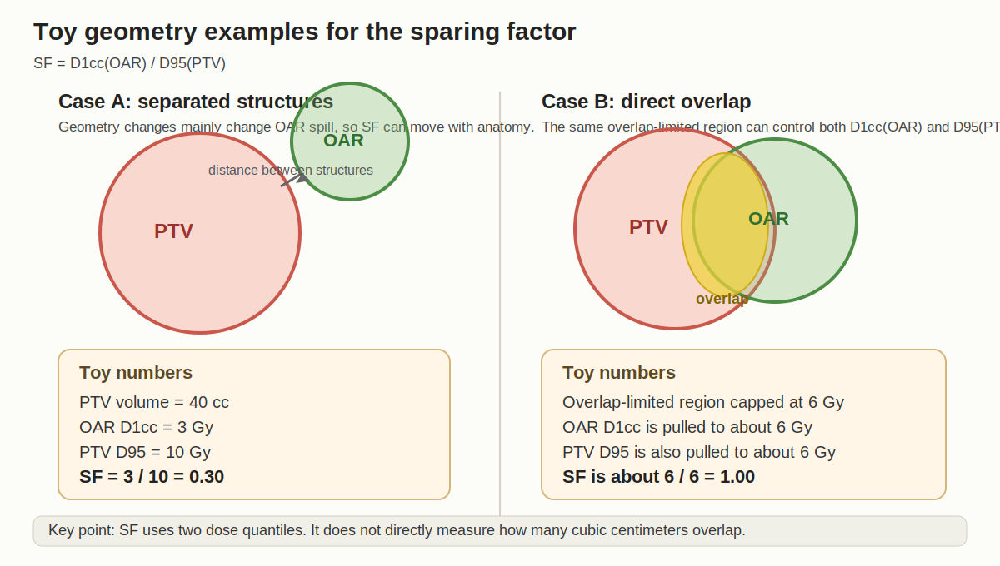
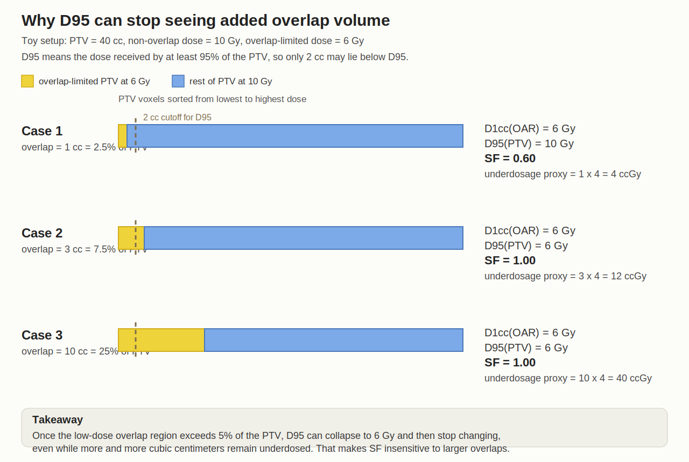
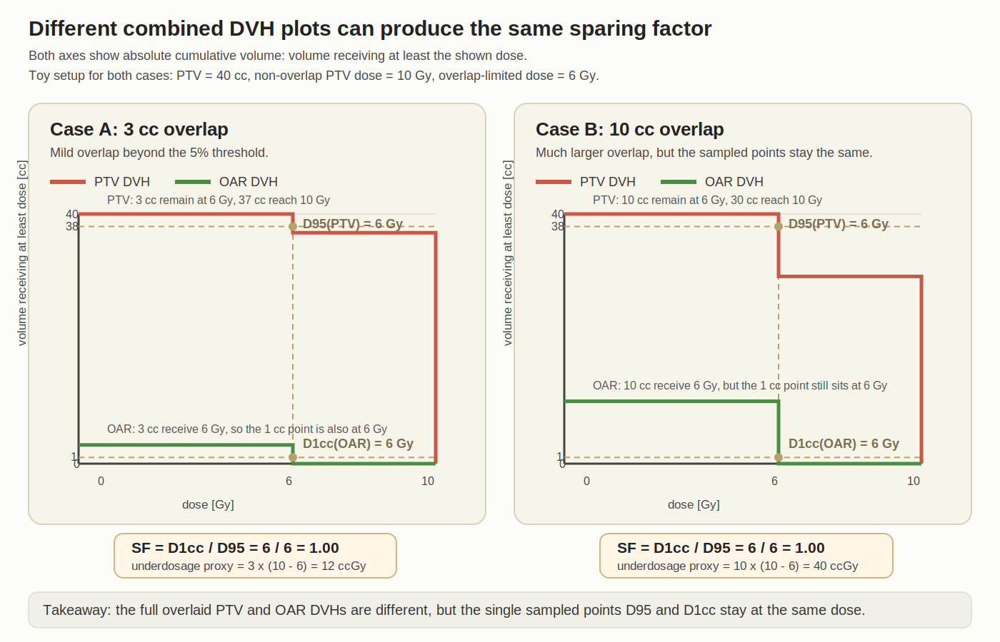
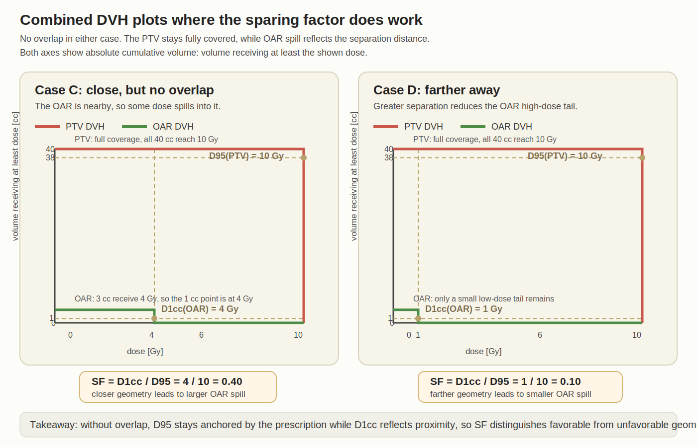

# Sparing Factor Toy Examples

This note explains, with toy numbers, why the 2023 sparing factor

`SF = D1cc(OAR) / D95(PTV)`

can become a weak geometry descriptor when the PTV and OAR directly overlap.

These are intentionally simplified examples. They are meant to show the metric behavior, not to reproduce a full treatment plan.

## Figure 1

When the structures are separated, the hottest `1 cc` of the OAR and the `95%` coverage point of the PTV can move fairly independently, so `SF` tracks geometry reasonably well.

When the structures overlap, both metrics can be controlled by the same overlap-limited region. Then both the numerator and denominator get pulled toward the OAR dose cap, so `SF` stays near `1`.

## Figure 2

This figure shows the threshold effect that makes `D95` insensitive to additional overlap volume.

Assumptions in the toy example:

- PTV volume = `40 cc`
- Dose in the non-overlap part of the PTV = `10 Gy`
- Dose in the overlap-limited part = `6 Gy`
- `D95` means: "the dose received by at least 95% of the PTV"
- Therefore only `5% * 40 cc = 2 cc` of the PTV may lie below `D95`

| Overlap volume | OAR D1cc | PTV D95 | Sparing factor | Simple underdosage proxy |
| --- | --- | --- | --- | --- |
| `1 cc` | `6 Gy` | `10 Gy` | `0.60` | `1 * (10 - 6) = 4 ccGy` |
| `3 cc` | `6 Gy` | `6 Gy` | `1.00` | `3 * (10 - 6) = 12 ccGy` |
| `10 cc` | `6 Gy` | `6 Gy` | `1.00` | `10 * (10 - 6) = 40 ccGy` |

The key behavior is:

- Once the overlap-limited part exceeds `5%` of the PTV, `D95` can drop to the overlap dose cap.
- After that point, increasing overlap volume can make the PTV underdosage much worse without changing `D95`.
- Since `D1cc(OAR)` is also pinned near the overlap dose cap, the ratio `D1cc / D95` can remain close to `1`.

## Figure 3

This figure shows two different toy combined DVH plots. In each case, the PTV and OAR curves are drawn on the same absolute-volume axes, and both cases have the same sparing factor.

In both cases:

- `D95(PTV) = 6 Gy`
- `D1cc(OAR) = 6 Gy`
- therefore `SF = 6 / 6 = 1.00`

But the overlaid curves are not the same.

| Case | Overlap-limited PTV volume | OAR volume at 6 Gy | PTV D95 | OAR D1cc | Sparing factor | Simple underdosage proxy |
| --- | --- | --- | --- | --- | --- | --- |
| A | `3 cc` | `3 cc` | `6 Gy` | `6 Gy` | `1.00` | `3 * (10 - 6) = 12 ccGy` |
| B | `10 cc` | `10 cc` | `6 Gy` | `6 Gy` | `1.00` | `10 * (10 - 6) = 40 ccGy` |

What this shows:

- The PTV DVH in Case B is much worse than in Case A because much more PTV is stuck at `6 Gy`.
- The OAR DVH in Case B also shows a larger high-dose volume.
- Yet the sparing factor is identical because it only samples one point from each DVH: `D95` on the PTV curve and `D1cc` on the OAR curve.

So even if the full DVHs are clearly different, the scalar summary `D1cc / D95` can hide that difference.

## Figure 4

This figure shows the complementary regime where the sparing factor is useful. There is no overlap in either case, and the only relevant geometric difference is that the OAR is closer to the PTV in one case than the other.

In both cases:

- the PTV still gets full coverage
- `D95(PTV) = 10 Gy`

But the OAR proximity changes:

- Case C: the OAR is closer, so `D1cc(OAR) = 4 Gy` and `SF = 4 / 10 = 0.40`
- Case D: the OAR is farther away, so `D1cc(OAR) = 1 Gy` and `SF = 1 / 10 = 0.10`

What this shows:

- With no overlap, the PTV DVH can stay essentially fixed at prescription.
- The OAR DVH then carries the geometric signal, because a larger separation gives lower OAR dose spill.
- In that regime, `D1cc / D95` behaves the way the 2023 paper wants: smaller values correspond to more favorable geometry.

That is why the 2025 paper switches to overlap volume itself as the state variable: it directly measures how many `cc` are affected, instead of relying on two dose quantiles.
